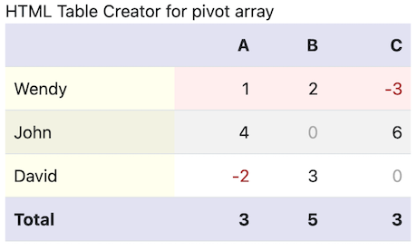

# Rubypivot

Rubypivot is a tool to make pivot table arrays for ruby.
It transforming a dataset or array of hashes into a spreadsheet-style array.

Suggestions and pull requests are welcome.

## Installation

```
gem install rubypivot
```

## Usage

Pivot class transform database record type array into pivot table Hash or Array

```ruby
require "rubypivot"
pivot = Rubypivot::Pivot.new(source_data, :month, :name, :value, data_type: :integer)
pivot_array = pivot.build
pivot_array.each do |line|
  p line
end
```

SpreadTable class makes a Hash table from pivot hash, which makes it easy to build HTML table with totals, layouts, colors.

```ruby
require "rubypivot"
pivot = Rubypivot::Pivot.new(source_data, :month, :name, :value, data_type: :integer)
pivot_hash = pivot.build_hash
spread = Rubypivot::SpreadTable.new(pivot_hash, data_type: :integer)
spread.rows.each do |row|
  puts row.to_s
end
```


```ruby
require "rubypivot"
spread = Rubypivot::SpreadTable.new(DATA_SOURCE, data_type: :integer)
puts spread.to_html(class: "table table-striped", line_end: :cr)
```
 

See sample scripts in examples folder.

Supported data aggregation is only SUM for numeric values.

Total calculation supported.


## History

- Ver. 0.0.3 : 2020-12-30 HTML table creation support
- Ver. 0.0.2 : 2020-12-30 SpreadTable: SpreadSheet type Array of Hashes(sheet row)
- Ver. 0.0.1 : 2020-12-28 First release. Making pivot array

## License

The gem is available as open source under the terms of the [MIT License](https://opensource.org/licenses/MIT).

